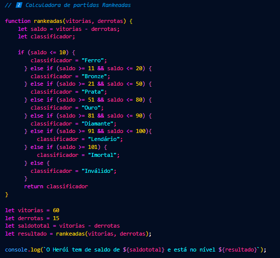

 # 2️⃣ Calculadora de partidas Rankeadas  

## Segundo desafio de Javascript da DIO, o objetivo era criar uma função que receba como parâmetro a quantidade de vitórias e derrotas de um jogador como saldo de Rankeadas, e depois, através do calculo *vitórias - derrotas*, classificar o saldo total de acordo com a tabela abaixo

Vitórias | Classificação
---------|-------------
menor ou igual a 10 | Ferro
entre 11 e 20 | Bronze
entre 21 e 50 | Prata
entre 51 e 80 | Ouro
entre 81 e 90 | Diamante
entre 91 e 100| Lendário
maior ou igual a 101 | Imortal

### Definindo a função rankeadas
Esta função calcula o saldo (vitórias - derrotas) e classifica o jogador em níveis como Ferro, Bronze, Prata, etc., com base no saldo.

### Calculando o saldo 
O saldo é a diferença entre vitórias e derrotas.

### Classificando o jogador
Dependendo do saldo, o jogador recebe uma classificação específica (por exemplo, Ferro se o saldo for até 10, Bronze se o saldo estiver entre 11 e 20, e assim por diante).

### Console
Exibe no console a mensagem com o saldo total e a classificação.  

### Detalhes
Este código em JavaScript foi escrito para calcular o saldo de partidas ranqueadas de um jogador e classificá-lo em diferentes níveis.  
Para fazer isso, ele usa uma função chamada rankeadas, que recebe como entrada o número de vitórias e derrotas. A função calcula a diferença entre esses valores, obtendo o saldo do jogador. Com base nesse saldo, a função determina a classificação do jogador em categorias como Ferro, Bronze, Prata, Ouro, Diamante, Lendário e Imortal.  
Após definir as vitórias e derrotas, o saldo é calculado subtraindo derrotas de vitórias. Em seguida, a função rankeadas é chamada para determinar a classificação, que é então exibida no console junto com o saldo total. Por exemplo, se um jogador tem 60 vitórias e 15 derrotas, o saldo seria 45, e a classificação resultante seria "Prata", que é exibida no console com uma mensagem informativa.

> Códigos com cálculos de partidas rankeadas são úteis para sistemas de jogos, onde é possível calcular a performance de um jogador com base nas vitórias e derrotas e, então, classificá-lo em diferentes níveis de habilidade.
